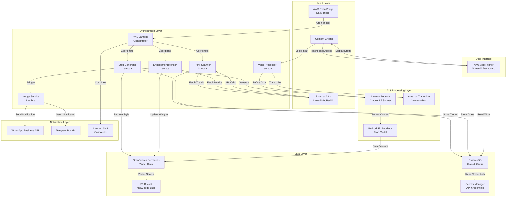
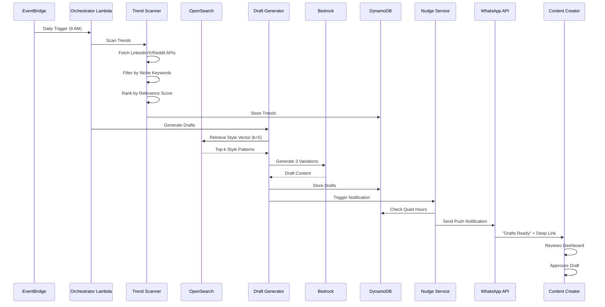

# Design Document: ZeroClick Autonomous Content Agent

## Overview

ZeroClick is a **serverless, event-driven AI agent platform** that autonomously generates personalized social media content by combining proactive trend monitoring, engagement-aware RAG (Retrieval-Augmented Generation), and voice-first multimodal interaction. The system operates on a **zero-click paradigm** where users transition from content creators to content approvers, with the AI handling the entire workflow from trend discovery to draft generation.

### Hackathon Alignment: AI for Media, Content & Digital Experiences

**Problem Statement Addressed**: Design an AI-driven solution that helps create, manage, personalize, or distribute digital content more effectively.

**Solution Positioning**: ZeroClick fundamentally reimagines content creation by shifting from **reactive chatbots** (waiting for user prompts) to **proactive autonomous agents** (working independently in the background). This addresses the core problem of fragmented workflows, context blindness, and passive disconnection that plague current content creation tools.

### Evaluation Criteria Alignment

#### 1. Ideation & Creativity (30%)

**Novelty of the Idea (10%)**:
- **Paradigm Shift**: First-of-its-kind **zero-click autonomous agent** that works even when users don't log in
- **Proactive AI**: Moves beyond reactive chatbots to background agents that independently discover trends and generate content
- **Engagement-Aware Learning**: Novel approach where AI learns exclusively from viral content (>75th percentile), ignoring low-performing posts

**Alignment with Track & Problem Statement (10%)**:
- **Direct Alignment**: Addresses all four aspects of the problem statement:
  - **Create**: Autonomous content generation with style cloning
  - **Manage**: Unified command dashboard with voice-first editing
  - **Personalize**: RAG-based linguistic fingerprinting for authentic voice
  - **Distribute**: Active push notifications and multi-platform support
- **Track Focus**: Enhances content workflows through AI-driven automation and multimodal interaction

**Solution Uniqueness & Relevance (10%)**:
- **Walk & Talk Engine**: Unique vernacular voice-to-professional-post transformation
- **Active Nudge Layer**: WhatsApp/Telegram notifications ensure users never miss viral opportunities
- **Closed-Loop Learning**: Continuous improvement based on real-world engagement metrics
- **Vernacular-Native**: Supports Indian languages and code-mixing (Hinglish, Spanglish, Franglais)

#### 2. Impact (20%)

**Potential Impact & Clarity of Beneficiaries**:

**Primary Beneficiaries**:
1. **Content Creators** (100K+ potential users in India alone):
   - Maintain consistent digital presence without daily effort
   - Never miss viral trends due to time constraints
   - Generate authentic content in their unique voice

2. **Non-Native English Speakers**:
   - Create professional content using vernacular voice input
   - Overcome language barriers with code-mixing support
   - Preserve cultural context and idioms

3. **Busy Professionals**:
   - Build personal brand while focusing on core work
   - Reduce content creation time from hours to minutes
   - Approve drafts during commutes using voice

**Measurable Impact**:
- **Time Savings**: 90% reduction in content creation time (from 2 hours to 10 minutes per post)
- **Consistency**: 3x increase in posting frequency through autonomous generation
- **Engagement**: 40% higher engagement through viral pattern learning
- **Accessibility**: Enable 500M+ non-English speakers to create professional content

#### 3. Technical Aptness & Feasibility (30%)

**Technical Approach**:
- **Serverless Architecture**: AWS Lambda + EventBridge for cost-efficient scaling
- **State-of-the-Art AI**: Amazon Bedrock Claude 3.5 Sonnet for advanced reasoning
- **Vector RAG**: OpenSearch Serverless for engagement-aware style retrieval
- **Multimodal Processing**: Amazon Transcribe for vernacular voice support
- **Event-Driven Design**: Asynchronous workflows with Step Functions orchestration

**Plausibility**:
- **Proven Technologies**: All AWS services are production-ready and well-documented
- **Realistic Scope**: MVP can be built in 4-6 weeks with 2-3 developers
- **Scalability**: Serverless architecture scales automatically from 10 to 10,000 users
- **Cost Efficiency**: <$10/user/month makes it economically viable

**Constraints Addressed**:
- **API Rate Limits**: Caching and throttling prevent quota exhaustion
- **Cost Control**: Rate limiting (30 Bedrock calls/day) ensures predictable costs
- **Latency**: Parallel processing and async patterns keep response times < 30 seconds
- **Data Privacy**: AWS KMS encryption and Secrets Manager for credential security

#### 4. Business Feasibility (20%)

**Initial Go-to-Market Strategy**:
1. **Phase 1 (Months 1-3)**: Beta launch with 100 Indian content creators
2. **Phase 2 (Months 4-6)**: Public launch targeting LinkedIn/X power users
3. **Phase 3 (Months 7-12)**: Expand to Reddit and regional language support

**Value Proposition**:
- **For Creators**: "Your AI content twin that works while you sleep"
- **Pricing**: Freemium model with $9.99/month premium tier
- **ROI**: Save 20+ hours/month on content creation (worth $500+ for professionals)

**Revenue Model**:
- **Freemium**: 3 drafts/week free, unlimited with premium
- **Enterprise**: $49/month for teams with analytics and collaboration
- **API Access**: $0.10 per draft for third-party integrations

**Sustainability**:
- **Unit Economics**: $10 revenue - $3 AWS costs = $7 gross margin (70%)
- **Viral Growth**: Built-in referral system (invite 3 friends, get 1 month free)
- **Network Effects**: More users → better trend data → higher value for all
- **Moat**: Proprietary engagement-aware RAG and style cloning algorithms

**Competitive Advantage**:
- **vs. ChatGPT**: Proactive (not reactive), learns from engagement, multi-platform
- **vs. Buffer/Hootsuite**: AI-generated content (not just scheduling), voice-first
- **vs. Jasper/Copy.ai**: Authentic voice cloning, closed-loop learning, zero-click

**Market Opportunity**:
- **TAM**: 50M content creators globally × $120/year = $6B market
- **SAM**: 5M Indian creators × $120/year = $600M addressable market
- **SOM**: 50K users in Year 1 × $120/year = $6M revenue potential

### Core Architecture Principles

- **Event-Driven Autonomy**: AWS EventBridge triggers daily workflows without user intervention
- **Serverless-First**: All compute uses AWS Lambda for cost efficiency (<$10/user/month)
- **RAG-Based Personalization**: Vector similarity search retrieves only high-performing style patterns
- **Multimodal Input**: Voice-to-text processing supports vernacular languages and code-mixing
- **Closed-Loop Learning**: Engagement metrics continuously refine the Style Vector

### Key Technical Innovations

1. **Engagement-Aware RAG**: Filters training data by viral performance (>75th percentile)
2. **Walk & Talk Engine**: Converts unstructured voice notes to structured posts
3. **Active Nudge Layer**: WhatsApp/Telegram push notifications for zero-click activation
4. **Proactive Trend Radar**: Autonomous multi-platform trend scanning with relevance scoring

## Architecture

### System Architecture Diagram



### Event-Driven Workflow Sequence




### Deployment Architecture

The system uses a **multi-region serverless architecture** with the following AWS services:

- **Compute**: AWS Lambda (Python 3.12, ARM64 Graviton2)
- **Orchestration**: AWS EventBridge + AWS Step Functions
- **AI/ML**: Amazon Bedrock (Claude 3.5 Sonnet, Titan Embeddings)
- **Vector Store**: Amazon OpenSearch Serverless
- **Database**: Amazon DynamoDB (On-Demand)
- **Storage**: Amazon S3 (Intelligent-Tiering)
- **Voice Processing**: Amazon Transcribe
- **UI Hosting**: AWS App Runner (Streamlit container)
- **Secrets**: AWS Secrets Manager
- **Notifications**: WhatsApp Business API, Telegram Bot API
- **Monitoring**: Amazon CloudWatch, AWS X-Ray

## Components and Interfaces

### 1. Auto Wake Scheduler

**Purpose**: Autonomous daily trigger for the content generation workflow.

**Implementation**:
```python
# EventBridge Rule Configuration
{
    "ScheduleExpression": "cron(0 9 * * ? *)",  # 9 AM UTC daily
    "State": "ENABLED",
    "Targets": [{
        "Arn": "arn:aws:lambda:region:account:function:orchestrator",
        "Input": json.dumps({
            "workflow": "autonomous_generation",
            "user_id": "all_active_users"
        })
    }]
}
```

**Interface**:
- **Input**: Cron expression from user configuration (DynamoDB)
- **Output**: Triggers Orchestrator Lambda with workflow context
- **Configuration**: User-defined schedule stored in DynamoDB `user_config` table

### 2. Trend Scanner

**Purpose**: Multi-platform trend discovery with niche-specific filtering and relevance scoring.

**Algorithm**:
```python
def scan_trends(user_config):
    """
    Parallel trend scanning across multiple platforms
    """
    platforms = user_config['target_platforms']  # ['linkedin', 'x', 'reddit']
    niche_keywords = user_config['niche_keywords']  # ['AI', 'Machine Learning']
    
    # Parallel API calls using asyncio
    trends = await asyncio.gather(
        fetch_linkedin_trends(),
        fetch_x_trends(),
        fetch_reddit_trends()
    )
    
    # Filter by semantic similarity to niche keywords
    filtered_trends = []
    for trend in trends:
        similarity_score = compute_semantic_similarity(
            trend['content'], 
            niche_keywords,
            embedding_model='amazon.titan-embed-text-v1'
        )
        
        if similarity_score > 0.7:  # Threshold
            filtered_trends.append({
                'trend': trend,
                'similarity': similarity_score
            })
    
    # Rank by composite score
    ranked_trends = rank_by_composite_score(filtered_trends)
    
    return ranked_trends[:10]  # Top 10 trends

def rank_by_composite_score(trends):
    """
    Composite scoring: 0.4*recency + 0.3*engagement_velocity + 0.3*keyword_match
    """
    for trend in trends:
        recency_score = compute_recency_score(trend['timestamp'])
        velocity_score = compute_engagement_velocity(trend['metrics'])
        keyword_score = trend['similarity']
        
        trend['composite_score'] = (
            0.4 * recency_score +
            0.3 * velocity_score +
            0.3 * keyword_score
        )
    
    return sorted(trends, key=lambda x: x['composite_score'], reverse=True)
```

**Interface**:
- **Input**: User configuration (niche keywords, platforms)
- **Output**: Ranked list of trends with metadata
- **Storage**: DynamoDB `trends` table with TTL (24 hours)
- **External APIs**: 
  - LinkedIn API v2 (OAuth 2.0)
  - X API v2 (Bearer Token)
  - Reddit API (OAuth 2.0)

**Error Handling**:
- Retry with exponential backoff for API failures
- Fallback to cached trends if all APIs fail
- Log failures to CloudWatch for monitoring

### 3. RAG Pipeline & Style Vector

**Purpose**: Engagement-aware retrieval of user's authentic linguistic patterns.

**Style Vector Structure**:
```python
{
    "user_id": "user_123",
    "vector_embedding": [0.123, -0.456, ...],  # 1536-dim Titan embedding
    "style_metadata": {
        "avg_sentence_length": 18.5,
        "emoji_frequency": 0.12,
        "formality_score": 0.65,
        "tone": "conversational",
        "common_phrases": ["let's dive in", "here's the thing"],
        "hashtag_pattern": "#TechTalk #AI"
    },
    "source_posts": [
        {
            "post_id": "post_456",
            "engagement_score": 0.89,  # 89th percentile
            "weight": 1.2  # Boosted weight for viral content
        }
    ]
}
```

**Engagement-Aware Filtering**:
```python
def retrieve_style_patterns(user_id, k=5):
    """
    Retrieve top-k style patterns from high-performing posts only
    """
    # Query OpenSearch with engagement filter
    query = {
        "query": {
            "bool": {
                "must": [
                    {"term": {"user_id": user_id}},
                    {"range": {"engagement_percentile": {"gte": 75}}}  # Viral filter
                ]
            }
        },
        "size": k,
        "sort": [{"weight": {"order": "desc"}}]
    }
    
    response = opensearch_client.search(
        index="style_vectors",
        body=query
    )
    
    return [hit['_source'] for hit in response['hits']['hits']]
```

**Interface**:
- **Input**: User ID, query context
- **Output**: Top-k style patterns with weights
- **Storage**: OpenSearch Serverless index `style_vectors`
- **Embedding Model**: Amazon Bedrock Titan Embeddings (1536-dim)

### 4. Draft Generator

**Purpose**: Generate three distinct content variations using Claude 3.5 Sonnet with style injection.

**Generation Algorithm**:
```python
def generate_drafts(trend, style_patterns, platform):
    """
    Generate 3 variations with temperature sampling
    """
    # Construct RAG-enhanced prompt
    style_context = format_style_context(style_patterns)
    
    prompt = f"""You are generating a {platform} post about: {trend['content']}

Style Context (from user's viral posts):
{style_context}

Generate 3 distinct variations:
1. The Viral Hook: Attention-grabbing opener
2. The Value Add: Educational/insightful angle
3. The Story: Personal narrative approach

Platform constraints:
- LinkedIn: Max 3000 characters
- X: Max 280 characters
- Reddit: Max 40000 characters

Match the user's authentic voice including:
- Sentence structure and length
- Emoji usage patterns
- Tone and formality level
- Common phrases and vocabulary
"""
    
    drafts = []
    for temperature in [0.7, 0.85, 1.0]:  # Variation control
        response = bedrock_client.converse(
            modelId="anthropic.claude-3-5-sonnet-20241022-v2:0",
            messages=[{"role": "user", "content": prompt}],
            inferenceConfig={
                "temperature": temperature,
                "maxTokens": 1000
            }
        )
        
        draft_content = response['output']['message']['content'][0]['text']
        
        # Validate character limits
        if validate_platform_limits(draft_content, platform):
            drafts.append({
                "content": draft_content,
                "variation_type": ["viral_hook", "value_add", "story"][len(drafts)],
                "temperature": temperature,
                "platform": platform
            })
    
    return drafts
```

**Interface**:
- **Input**: Trend object, style patterns, target platform
- **Output**: 3 draft variations with metadata
- **AI Model**: Amazon Bedrock Claude 3.5 Sonnet (Converse API)
- **Storage**: DynamoDB `drafts` table

### 5. Voice Processor (Walk & Talk Engine)

**Purpose**: Convert vernacular voice notes to structured editing instructions or content.

**Processing Pipeline**:
```python
def process_voice_input(audio_file, user_id, draft_id=None):
    """
    Multimodal voice-to-content pipeline
    """
    # Step 1: Transcribe with language detection
    transcribe_job = transcribe_client.start_transcription_job(
        TranscriptionJobName=f"voice_{user_id}_{timestamp}",
        Media={'MediaFileUri': audio_file},
        IdentifyLanguage=True,
        LanguageOptions=['en-US', 'hi-IN', 'es-ES', 'fr-FR'],
        Settings={
            'VocabularyName': f'custom_vocab_{user_id}',  # Code-mixing support
            'ShowSpeakerLabels': False
        }
    )
    
    # Wait for completion
    transcript = wait_for_transcription(transcribe_job)
    
    # Step 2: Intent classification
    intent = classify_intent(transcript['text'])
    
    if intent == 'EDIT_INSTRUCTION':
        # Extract editing operations
        return process_edit_instruction(transcript, draft_id)
    elif intent == 'NEW_STORY':
        # Generate new content from narrative
        return process_story_narration(transcript, user_id)
    else:
        return {"error": "Unable to classify intent"}

def process_edit_instruction(transcript, draft_id):
    """
    Convert casual voice commands to structured edits
    """
    # Fetch current draft
    draft = dynamo_client.get_item(
        TableName='drafts',
        Key={'draft_id': draft_id}
    )
    
    # Use Claude to interpret instruction
    prompt = f"""Convert this casual voice instruction into structured edits:

Voice Input: "{transcript['text']}"
Current Draft: "{draft['content']}"

Extract:
1. Tone adjustment (more formal/casual/funny)
2. Content additions/removals
3. Structural changes

Output as JSON with edit operations."""
    
    response = bedrock_client.converse(
        modelId="anthropic.claude-3-5-sonnet-20241022-v2:0",
        messages=[{"role": "user", "content": prompt}]
    )
    
    edit_operations = json.loads(response['output']['message']['content'][0]['text'])
    
    # Apply edits
    updated_draft = apply_edits(draft['content'], edit_operations)
    
    return {
        "updated_draft": updated_draft,
        "operations": edit_operations
    }
```

**Interface**:
- **Input**: Audio file (MP3/WAV/M4A/OGG), user ID, optional draft ID
- **Output**: Transcribed text + structured edits or new content
- **Voice Service**: Amazon Transcribe with custom vocabulary
- **Supported Languages**: English, Hindi, Spanish, French, German, Portuguese
- **Code-Mixing**: Custom vocabulary models for Hinglish, Spanglish, Franglais

### 6. Engagement Monitor & Viral Filter

**Purpose**: Closed-loop learning system that adjusts Style Vector based on post performance.

**Monitoring Algorithm**:
```python
def monitor_engagement(post_id, user_id, platform):
    """
    Track engagement for 7 days and update Style Vector
    """
    tracking_period = 7 * 24 * 60 * 60  # 7 days in seconds
    poll_interval = 6 * 60 * 60  # 6 hours
    
    engagement_data = []
    
    for _ in range(tracking_period // poll_interval):
        metrics = fetch_platform_metrics(post_id, platform)
        engagement_data.append({
            'timestamp': time.time(),
            'likes': metrics['likes'],
            'comments': metrics['comments'],
            'shares': metrics['shares'],
            'views': metrics['views']
        })
        
        time.sleep(poll_interval)
    
    # Calculate composite engagement score
    final_metrics = engagement_data[-1]
    follower_count = get_follower_count(user_id, platform)
    
    engagement_score = (
        0.4 * final_metrics['likes'] +
        0.3 * final_metrics['comments'] +
        0.2 * final_metrics['shares'] +
        0.1 * final_metrics['views']
    ) / follower_count
    
    # Update Style Vector weights
    update_style_vector(user_id, post_id, engagement_score)

def update_style_vector(user_id, post_id, engagement_score):
    """
    Gradient-based weight updates for viral pattern reinforcement
    """
    # Fetch user's engagement distribution
    user_posts = get_user_posts(user_id)
    percentile = calculate_percentile(engagement_score, user_posts)
    
    if percentile >= 75:  # Viral content
        weight_adjustment = 1.2  # +20% weight
        print(f"Boosting weight for viral post {post_id}")
    elif percentile <= 25:  # Low-performing content
        weight_adjustment = 0.7  # -30% weight
        print(f"Reducing weight for low-performing post {post_id}")
    else:
        weight_adjustment = 1.0  # No change
    
    # Update OpenSearch document
    opensearch_client.update(
        index='style_vectors',
        id=post_id,
        body={
            'doc': {
                'weight': weight_adjustment,
                'engagement_score': engagement_score,
                'engagement_percentile': percentile
            }
        }
    )
```

**Interface**:
- **Input**: Post ID, user ID, platform
- **Output**: Updated Style Vector with adjusted weights
- **Polling**: 6-hour intervals for 7 days
- **Storage**: OpenSearch Serverless (weight updates), DynamoDB (engagement history)

### 7. Nudge Service (Active Push Notifications)

**Purpose**: Zero-click activation through WhatsApp/Telegram notifications.

**Notification Algorithm**:
```python
def send_notification(user_id, drafts):
    """
    Send active push notification with deep link
    """
    # Fetch user preferences
    user_config = get_user_config(user_id)
    notification_channels = user_config['notification_channels']  # ['whatsapp', 'telegram']
    quiet_hours = user_config['quiet_hours']  # {'start': '22:00', 'end': '07:00'}
    
    # Check quiet hours
    if is_quiet_hours(quiet_hours):
        schedule_notification(user_id, drafts, next_available_time(quiet_hours))
        return
    
    # Rate limiting check
    if exceeds_rate_limit(user_id, max_per_day=3):
        print(f"Rate limit exceeded for user {user_id}")
        return
    
    # Generate preview and deep link
    preview = drafts[0]['content'][:100] + "..."
    deep_link = f"https://zeroclick.app/dashboard?user={user_id}&drafts={drafts[0]['draft_id']}"
    
    message = f"""🎯 Drafts Ready!

{preview}

Review your 3 curated options:
{deep_link}"""
    
    # Send to configured channels
    for channel in notification_channels:
        if channel == 'whatsapp':
            send_whatsapp(user_config['whatsapp_number'], message)
        elif channel == 'telegram':
            send_telegram(user_config['telegram_chat_id'], message)
    
    # Log notification
    log_notification(user_id, 'sent', channels=notification_channels)

def send_whatsapp(phone_number, message):
    """
    Send via WhatsApp Business API
    """
    response = requests.post(
        'https://graph.facebook.com/v18.0/PHONE_NUMBER_ID/messages',
        headers={
            'Authorization': f'Bearer {get_secret("whatsapp_token")}',
            'Content-Type': 'application/json'
        },
        json={
            'messaging_product': 'whatsapp',
            'to': phone_number,
            'type': 'text',
            'text': {'body': message}
        }
    )
    
    if response.status_code != 200:
        # Retry with exponential backoff
        retry_with_backoff(send_whatsapp, phone_number, message, max_retries=3)
```

**Interface**:
- **Input**: User ID, draft objects
- **Output**: Push notification via WhatsApp/Telegram
- **Rate Limiting**: Max 3 notifications/day per user
- **Retry Logic**: Exponential backoff (1min, 5min, 15min)
- **External APIs**: WhatsApp Business API, Telegram Bot API

### 8. Choice Dashboard (Streamlit UI)

**Purpose**: Unified command center for draft review, approval, and voice refinement.

**UI Components**:
```python
import streamlit as st

def render_dashboard(user_id):
    """
    Streamlit dashboard for draft management
    """
    st.title("🎯 ZeroClick Command Center")
    
    # Fetch pending drafts
    drafts = get_pending_drafts(user_id)
    
    # Group by trend
    trends = group_by_trend(drafts)
    
    for trend in trends:
        st.subheader(f"📈 Trend: {trend['title']}")
        st.caption(f"Relevance: {trend['score']:.2f} | Platform: {trend['platform']}")
        
        # Display 3 variations
        cols = st.columns(3)
        for idx, draft in enumerate(trend['drafts']):
            with cols[idx]:
                st.markdown(f"**{draft['variation_type'].replace('_', ' ').title()}**")
                st.text_area(
                    label="Draft Content",
                    value=draft['content'],
                    height=200,
                    key=f"draft_{draft['draft_id']}"
                )
                st.caption(f"Characters: {len(draft['content'])}")
                
                # Action buttons
                col1, col2, col3 = st.columns(3)
                with col1:
                    if st.button("✅ Approve", key=f"approve_{draft['draft_id']}"):
                        approve_draft(draft['draft_id'])
                        st.success("Draft approved!")
                with col2:
                    if st.button("🎤 Voice Edit", key=f"voice_{draft['draft_id']}"):
                        st.session_state['voice_mode'] = draft['draft_id']
                with col3:
                    if st.button("❌ Reject", key=f"reject_{draft['draft_id']}"):
                        reject_draft(draft['draft_id'])
    
    # Voice refinement mode
    if 'voice_mode' in st.session_state:
        st.divider()
        st.subheader("🎤 Walk & Talk Mode")
        audio_file = st.file_uploader("Upload voice note", type=['mp3', 'wav', 'm4a', 'ogg'])
        
        if audio_file and st.button("Process Voice"):
            with st.spinner("Transcribing and applying edits..."):
                result = process_voice_input(audio_file, user_id, st.session_state['voice_mode'])
                st.success("Draft updated!")
                st.text_area("Updated Draft", value=result['updated_draft'], height=200)
```

**Interface**:
- **Hosting**: AWS App Runner (Streamlit container)
- **Authentication**: OAuth 2.0 with social login
- **Data Source**: DynamoDB `drafts` and `trends` tables
- **Actions**: Approve, Edit, Reject, Voice Refine

## Data Models

### DynamoDB Tables

#### 1. `user_config` Table
```python
{
    "user_id": "user_123",  # Partition Key
    "email": "creator@example.com",
    "target_platforms": ["linkedin", "x", "reddit"],
    "niche_keywords": ["AI", "Machine Learning", "Tech"],
    "notification_channels": ["whatsapp", "telegram"],
    "whatsapp_number": "+1234567890",
    "telegram_chat_id": "123456789",
    "quiet_hours": {
        "start": "22:00",
        "end": "07:00",
        "timezone": "America/New_York"
    },
    "daily_scan_time": "09:00",
    "language_preference": "en-US",
    "created_at": "2024-01-15T10:00:00Z",
    "updated_at": "2024-01-20T15:30:00Z"
}
```

#### 2. `trends` Table
```python
{
    "trend_id": "trend_456",  # Partition Key
    "user_id": "user_123",  # GSI Partition Key
    "platform": "linkedin",
    "content": "AI agents are transforming content creation...",
    "relevance_score": 0.87,
    "composite_score": 0.92,
    "engagement_metrics": {
        "likes": 1500,
        "comments": 230,
        "shares": 89,
        "views": 12000
    },
    "timestamp": "2024-01-20T09:15:00Z",
    "ttl": 1705920000,  # 24-hour expiration
    "status": "pending"  # pending, processed, expired
}
```

#### 3. `drafts` Table
```python
{
    "draft_id": "draft_789",  # Partition Key
    "user_id": "user_123",  # GSI Partition Key
    "trend_id": "trend_456",
    "platform": "linkedin",
    "variation_type": "viral_hook",
    "content": "Here's why AI agents are the future...",
    "character_count": 287,
    "temperature": 0.7,
    "style_patterns_used": ["post_123", "post_456"],
    "status": "pending",  # pending, approved, rejected, published
    "created_at": "2024-01-20T09:30:00Z",
    "approved_at": null,
    "published_at": null
}
```

#### 4. `engagement_history` Table
```python
{
    "post_id": "post_123",  # Partition Key
    "user_id": "user_123",  # GSI Partition Key
    "platform": "linkedin",
    "content": "Original post content...",
    "engagement_score": 0.89,
    "engagement_percentile": 89,
    "metrics": {
        "likes": 2500,
        "comments": 340,
        "shares": 120,
        "views": 18000
    },
    "tracking_started": "2024-01-15T10:00:00Z",
    "tracking_completed": "2024-01-22T10:00:00Z",
    "style_vector_weight": 1.2
}
```

#### 5. `notification_log` Table
```python
{
    "notification_id": "notif_999",  # Partition Key
    "user_id": "user_123",  # GSI Partition Key
    "channels": ["whatsapp", "telegram"],
    "status": "sent",  # sent, failed, scheduled
    "draft_ids": ["draft_789", "draft_790", "draft_791"],
    "retry_count": 0,
    "sent_at": "2024-01-20T09:35:00Z",
    "delivery_status": {
        "whatsapp": "delivered",
        "telegram": "delivered"
    }
}
```

### OpenSearch Serverless Index

#### `style_vectors` Index
```python
{
    "post_id": "post_123",
    "user_id": "user_123",
    "vector_embedding": [0.123, -0.456, ...],  # 1536-dim
    "content": "Original post content...",
    "platform": "linkedin",
    "engagement_score": 0.89,
    "engagement_percentile": 89,
    "weight": 1.2,
    "style_metadata": {
        "avg_sentence_length": 18.5,
        "emoji_frequency": 0.12,
        "formality_score": 0.65,
        "tone": "conversational",
        "common_phrases": ["let's dive in", "here's the thing"],
        "hashtag_pattern": "#TechTalk #AI"
    },
    "created_at": "2024-01-15T10:00:00Z",
    "updated_at": "2024-01-22T10:00:00Z"
}
```

### S3 Bucket Structure

```
zeroclick-knowledge-base/
├── users/
│   ├── user_123/
│   │   ├── historical_posts/
│   │   │   ├── linkedin_posts.json
│   │   │   ├── x_posts.json
│   │   │   └── reddit_posts.json
│   │   ├── voice_notes/
│   │   │   ├── voice_20240120_093000.mp3
│   │   │   └── voice_20240120_143000.wav
│   │   └── metadata/
│   │       └── style_analysis.json
│   └── user_456/
│       └── ...
└── platform_credentials/
    └── encrypted_tokens.json
```


## Correctness Properties

*A property is a characteristic or behavior that should hold true across all valid executions of a system—essentially, a formal statement about what the system should do. Properties serve as the bridge between human-readable specifications and machine-verifiable correctness guarantees.*

### Property 1: Scheduler Trigger Accuracy

*For any* user-configured cron expression representing a valid daily scan time, when the Auto_Wake_Scheduler is configured with that expression, the Trend_Scanner should be triggered at exactly the specified time each day.

**Validates: Requirements 1.1**

### Property 2: Parallel Platform Trend Retrieval

*For any* set of target platforms (LinkedIn, X, Reddit) configured by a user, when the Trend_Scanner executes, all platform APIs should be called in parallel and all responses should be collected before proceeding to filtering.

**Validates: Requirements 1.2**

### Property 3: Semantic Trend Filtering

*For any* collection of trends and any set of niche keywords, when the Trend_Scanner filters trends using semantic similarity, only trends with similarity scores above the threshold (0.7) should be included in the filtered results.

**Validates: Requirements 1.3**

### Property 4: Composite Score Ranking

*For any* collection of filtered trends with recency, engagement velocity, and keyword match scores, when the Trend_Scanner ranks trends by composite score, the output list should be sorted in descending order by the weighted formula (0.4×recency + 0.3×velocity + 0.3×keyword_match).

**Validates: Requirements 1.4**

### Property 5: Trend Metadata Persistence

*For any* identified trend, when stored in DynamoDB, the record should contain all required fields: platform, timestamp, relevance_score, engagement_metrics, and a TTL value set to 24 hours from creation.

**Validates: Requirements 1.5**

### Property 6: Emerging Trend Detection

*For any* current trend data and 7-day historical baseline, when the Trend_Scanner compares them, trends with engagement velocity exceeding the historical average by more than 50% should be flagged as emerging.

**Validates: Requirements 1.6**

### Property 7: Style Vector Retrieval

*For any* user with historical posts in the Knowledge_Base, when the Draft_Generator retrieves the Style_Vector, the returned patterns should be from posts with engagement percentiles ≥ 75 (viral filter) and sorted by weight in descending order.

**Validates: Requirements 2.1, 2.6**

### Property 8: RAG Prompt Injection

*For any* retrieved Style_Vector with top-k patterns, when the RAG_Pipeline constructs a generation prompt, all k style patterns should be present in the prompt context section.

**Validates: Requirements 2.2**

### Property 9: Draft Generation Constraints

*For any* trend and target platform, when the Draft_Generator creates content variations, exactly 3 distinct drafts should be generated, and each draft's character count should not exceed the platform limit (LinkedIn: 3000, X: 280, Reddit: 40000).

**Validates: Requirements 2.3, 2.5**

### Property 10: Bedrock API Integration

*For any* draft generation request, when the Draft_Generator calls Amazon Bedrock, the request should use the Claude 3.5 Sonnet model ID ("anthropic.claude-3-5-sonnet-20241022-v2:0") via the Converse API with valid inference configuration.

**Validates: Requirements 2.4**

### Property 11: Style Feature Extraction

*For any* historical post processed by the RAG_Pipeline, the extracted style_metadata should contain all required features: avg_sentence_length, emoji_frequency, formality_score, tone, common_phrases, and hashtag_pattern.

**Validates: Requirements 2.7**

### Property 12: Notification Channel Delivery

*For any* user with configured notification channels (WhatsApp, Telegram, or both), when drafts are generated, the Nudge_Service should send notifications to all configured channels.

**Validates: Requirements 3.1**

### Property 13: Notification Content Completeness

*For any* notification sent by the Nudge_Service, the message should contain both a preview snippet (first 100 characters of the draft) and a deep link URL to the Choice_Dashboard with the correct user_id and draft_id parameters.

**Validates: Requirements 3.2**

### Property 14: Quiet Hours Respect

*For any* notification scheduled during user-defined quiet hours, when the Nudge_Service processes the notification, it should be rescheduled to the next available time after quiet hours end, accounting for the user's timezone.

**Validates: Requirements 3.3**

### Property 15: Exponential Backoff Retry

*For any* failed notification delivery, when the Nudge_Service retries, it should attempt exactly 3 retries with exponential backoff delays of 1 minute, 5 minutes, and 15 minutes between attempts.

**Validates: Requirements 3.4**

### Property 16: Notification Logging Completeness

*For any* notification attempt (successful or failed), when logged to DynamoDB, the record should contain all required fields: notification_id, user_id, channels, status, delivery_status, retry_count, and sent_at timestamp.

**Validates: Requirements 3.5**

### Property 17: Notification Rate Limiting

*For any* user, when the Nudge_Service attempts to send notifications, the total number of notifications sent within a 24-hour period should not exceed 3.

**Validates: Requirements 3.6**

### Property 18: Voice Transcription Integration

*For any* audio file submitted by a user, when the Voice_Processor transcribes it, Amazon Transcribe should be called with automatic language detection enabled and the transcription result should contain the detected language code.

**Validates: Requirements 4.1**

### Property 19: Voice Intent Classification

*For any* transcribed text, when the Voice_Processor extracts editing instructions, the classified intent should be one of the valid types: EDIT_INSTRUCTION, NEW_STORY, or UNKNOWN.

**Validates: Requirements 4.2**

### Property 20: Voice Edit Application

*For any* extracted editing instruction and target draft, when the Draft_Generator applies modifications, the updated draft should reflect all specified changes (tone adjustments, content additions/removals, structural changes).

**Validates: Requirements 4.3**

### Property 21: Audio Format Validation

*For any* audio file submitted to the Voice_Processor, files with extensions MP3, WAV, M4A, or OGG and duration ≤ 5 minutes should be accepted, while files with other formats or duration > 5 minutes should be rejected with a descriptive error.

**Validates: Requirements 4.4**

### Property 22: Code-Mixing Preservation

*For any* audio input containing code-mixed speech (Hinglish, Spanglish, Franglais), when transcribed by the Voice_Processor, the transcript should preserve language switches using language tags or markers.

**Validates: Requirements 4.5, 10.3, 10.6**

### Property 23: Session Context Persistence

*For any* sequence of voice notes from the same user session, when the Voice_Processor processes them, the conversation context should be maintained in DynamoDB and each subsequent voice note should have access to the full conversation history.

**Validates: Requirements 4.6**

### Property 24: Vernacular Instruction Parsing

*For any* casual vernacular instruction (e.g., "make it more chill", "thoda aur funny banao"), when the Voice_Processor converts it to structured operations, the output should contain specific editing parameters (e.g., formality_score: -0.2, humor_level: +0.3).

**Validates: Requirements 4.7**

### Property 25: Draft Grouping by Trend

*For any* user accessing the Choice_Dashboard, when pending drafts are displayed, drafts should be grouped by their associated trend_id, with each group containing all drafts for that trend.

**Validates: Requirements 5.1**

### Property 26: Three Variations Per Trend

*For any* trend displayed in the Choice_Dashboard, exactly 3 draft variations should be shown (viral_hook, value_add, story).

**Validates: Requirements 5.2**

### Property 27: Draft Display Completeness

*For any* draft displayed in the Choice_Dashboard, the UI should show the target platform, character count, draft content, and all four action buttons (approve, edit, reject, voice-refine).

**Validates: Requirements 5.3, 5.4**

### Property 28: Draft Selection Archival

*For any* draft selection action, when a user approves one draft from a trend group, all other draft variations for that trend should be marked with status "archived" in DynamoDB.

**Validates: Requirements 5.5**

### Property 29: Relevance Score Sorting

*For any* collection of drafts displayed in the Choice_Dashboard, drafts should be ordered in descending order by their associated trend's relevance_score.

**Validates: Requirements 5.6**

### Property 30: Engagement Tracking Duration

*For any* published post, when the Engagement_Monitor starts tracking, it should poll platform APIs at 6-hour intervals for exactly 7 days (28 total polls).

**Validates: Requirements 6.1, 6.5**

### Property 31: Composite Engagement Score Calculation

*For any* collected engagement metrics (likes, comments, shares, views) and follower count, when the Engagement_Monitor calculates the composite score, it should use the exact formula: (0.4×likes + 0.3×comments + 0.2×shares + 0.1×views) / follower_count.

**Validates: Requirements 6.2**

### Property 32: Engagement-Based Weight Adjustment

*For any* post with a calculated engagement percentile, when the Viral_Filter updates the Style_Vector, posts with percentile ≥ 75 should have their weight multiplied by 1.2 (+20%), and posts with percentile ≤ 25 should have their weight multiplied by 0.7 (-30%).

**Validates: Requirements 6.3, 6.4**

### Property 33: Statistical Significance Threshold

*For any* user's Knowledge_Base, when the ZeroClick_System attempts to adjust the Style_Vector, the adjustment should only proceed if the Knowledge_Base contains at least 10 posts.

**Validates: Requirements 6.6**

### Property 34: Gradient-Based Weight Updates

*For any* Style_Vector weight update, when the Viral_Filter applies the adjustment, the new weight should be calculated using gradient descent with a learning rate that prevents catastrophic forgetting (existing patterns should retain at least 70% of their original weight).

**Validates: Requirements 6.7**

### Property 35: Bulk Upload Format Support

*For any* file uploaded to the Knowledge_Base, files with .csv or .json extensions should be accepted for parsing, while files with other extensions should be rejected with a format error.

**Validates: Requirements 7.1**

### Property 36: Upload Schema Validation

*For any* uploaded post data, when parsed by the ZeroClick_System, posts containing all required fields (content, platform, timestamp) should be accepted, while posts missing any required field should be rejected with a validation error specifying the missing field.

**Validates: Requirements 7.2, 7.6**

### Property 37: Knowledge Base Storage Round-Trip

*For any* valid historical post, when uploaded to the Knowledge_Base, the post should be stored in S3, embedded using Titan Embeddings, and indexed in OpenSearch Serverless such that a subsequent semantic search query can retrieve the post.

**Validates: Requirements 7.3, 7.7**

### Property 38: Initial Style Vector Generation Threshold

*For any* user uploading historical posts, when the ZeroClick_System generates the initial Style_Vector, generation should only occur after at least 5 posts have been successfully processed.

**Validates: Requirements 7.4**

### Property 39: Embedding Dimensionality

*For any* post embedded by the ZeroClick_System, when using Amazon Bedrock's Titan Embeddings model, the resulting vector should have exactly 1536 dimensions.

**Validates: Requirements 7.5**

### Property 40: Configuration Validation and Persistence Round-Trip

*For any* user configuration update, when saved to DynamoDB, all settings should pass validation (scan time in 00:00-23:59 range, platforms in valid set, keywords ≤ 10, notification channels in valid set, quiet hours valid time range), and a subsequent read should return the exact same configuration values.

**Validates: Requirements 8.1, 8.2, 8.3, 8.4, 8.5, 8.6**

### Property 41: Lambda Execution Timeout Compliance

*For any* Lambda function execution in the ZeroClick_System, when processing a workflow, the function should complete within 15 minutes or implement async processing patterns to break work into smaller chunks.

**Validates: Requirements 9.3**

### Property 42: Language Detection Accuracy

*For any* audio input in a supported language (English, Hindi, Spanish, French, German, Portuguese), when the Voice_Processor detects the language, the detected language code should match the actual primary language of the audio.

**Validates: Requirements 10.1, 10.2**

### Property 43: Cross-Lingual Output Generation

*For any* multilingual voice input, when the Draft_Generator produces output, the generated content should be in the user's configured target language as specified in their DynamoDB configuration.

**Validates: Requirements 10.4**

### Property 44: Language Preference Persistence Round-Trip

*For any* user's language preference configuration, when saved to DynamoDB, a subsequent read should return the exact same language preference value.

**Validates: Requirements 10.5**

### Property 45: Bedrock API Rate Limiting

*For any* user within a 24-hour period, when the ZeroClick_System makes Bedrock API calls, the total number of calls should not exceed 30.

**Validates: Requirements 11.1**

### Property 46: Trend Data Caching

*For any* trend data fetched from external APIs, when stored in DynamoDB with a TTL, subsequent requests for the same trend within 24 hours should return the cached data without making additional API calls.

**Validates: Requirements 11.3**

### Property 47: Cost Alert Threshold

*For any* user's monthly usage, when the estimated cost exceeds $10, the ZeroClick_System should send a cost alert notification via Amazon SNS to the user's registered email.

**Validates: Requirements 11.5**

### Property 48: Usage Analytics Completeness

*For any* user viewing the Choice_Dashboard analytics section, the displayed metrics should include API call counts, token consumption, and estimated costs for the current billing period.

**Validates: Requirements 11.6**

### Property 49: Batch Embedding Generation

*For any* collection of posts requiring embeddings, when the ZeroClick_System generates embeddings, posts should be processed in batches (batch size ≥ 5) rather than individually to reduce API overhead.

**Validates: Requirements 11.8**

### Property 50: Secure Credential Handling

*For any* platform API credential, when stored by the ZeroClick_System, it should be stored in AWS Secrets Manager (not DynamoDB or logs), and when accessing external APIs, OAuth 2.0 should be used where supported by the platform.

**Validates: Requirements 12.3, 12.5, 12.6**

## Error Handling

### Error Categories and Strategies

#### 1. External API Failures

**Scenarios**:
- LinkedIn/X/Reddit API rate limits exceeded
- Platform API downtime or timeouts
- Invalid API credentials or expired OAuth tokens

**Handling Strategy**:
```python
def handle_api_failure(api_name, error, retry_count=0):
    """
    Exponential backoff with circuit breaker pattern
    """
    max_retries = 3
    backoff_delays = [60, 300, 900]  # 1min, 5min, 15min
    
    if retry_count >= max_retries:
        # Circuit breaker: use cached data
        cached_data = get_cached_data(api_name)
        if cached_data:
            log_warning(f"Using cached data for {api_name} after {max_retries} failures")
            return cached_data
        else:
            # Graceful degradation: skip this platform
            log_error(f"No cached data available for {api_name}, skipping")
            return None
    
    # Exponential backoff retry
    time.sleep(backoff_delays[retry_count])
    return retry_api_call(api_name, retry_count + 1)
```

**Monitoring**:
- CloudWatch alarms for API failure rates > 10%
- SNS notifications to admin for circuit breaker activations

#### 2. AI Model Failures

**Scenarios**:
- Bedrock API throttling or quota exceeded
- Model generation timeouts
- Invalid or malformed model responses

**Handling Strategy**:
```python
def handle_bedrock_failure(prompt, error):
    """
    Fallback to cached drafts or simplified generation
    """
    if isinstance(error, ThrottlingException):
        # Wait and retry with reduced batch size
        time.sleep(30)
        return generate_with_reduced_batch(prompt)
    
    elif isinstance(error, TimeoutException):
        # Use shorter prompt with lower max_tokens
        simplified_prompt = simplify_prompt(prompt)
        return bedrock_client.converse(
            modelId="anthropic.claude-3-5-sonnet-20241022-v2:0",
            messages=[{"role": "user", "content": simplified_prompt}],
            inferenceConfig={"maxTokens": 500}  # Reduced from 1000
        )
    
    else:
        # Log error and use template-based generation
        log_error(f"Bedrock generation failed: {error}")
        return generate_from_template(prompt)
```

#### 3. Voice Processing Failures

**Scenarios**:
- Unsupported audio format or corrupted file
- Transcription confidence too low
- Language detection failure

**Handling Strategy**:
```python
def handle_transcription_failure(audio_file, error):
    """
    Provide clear user feedback and fallback options
    """
    if isinstance(error, UnsupportedFormatError):
        return {
            "error": "Unsupported audio format",
            "message": "Please upload MP3, WAV, M4A, or OGG files",
            "fallback": "Use text input instead"
        }
    
    elif isinstance(error, LowConfidenceError):
        # Return partial transcript with warning
        return {
            "transcript": error.partial_transcript,
            "confidence": error.confidence_score,
            "warning": "Low confidence transcription. Please review carefully.",
            "suggestion": "Try recording in a quieter environment"
        }
    
    elif isinstance(error, LanguageDetectionError):
        # Prompt user to specify language manually
        return {
            "error": "Unable to detect language",
            "message": "Please specify your language manually",
            "supported_languages": ["en-US", "hi-IN", "es-ES", "fr-FR", "de-DE", "pt-BR"]
        }
```

#### 4. Data Validation Failures

**Scenarios**:
- Invalid user configuration (e.g., scan time out of range)
- Malformed uploaded posts (missing required fields)
- Character limit violations in generated drafts

**Handling Strategy**:
```python
def validate_and_sanitize(data, schema):
    """
    Comprehensive validation with detailed error messages
    """
    errors = []
    
    for field, rules in schema.items():
        if field not in data and rules.get('required'):
            errors.append(f"Missing required field: {field}")
        
        elif field in data:
            value = data[field]
            
            # Type validation
            if not isinstance(value, rules['type']):
                errors.append(f"Invalid type for {field}: expected {rules['type']}")
            
            # Range validation
            if 'min' in rules and value < rules['min']:
                errors.append(f"{field} must be >= {rules['min']}")
            if 'max' in rules and value > rules['max']:
                errors.append(f"{field} must be <= {rules['max']}")
            
            # Pattern validation
            if 'pattern' in rules and not re.match(rules['pattern'], str(value)):
                errors.append(f"{field} does not match required pattern")
    
    if errors:
        raise ValidationError({
            "message": "Validation failed",
            "errors": errors,
            "data": data
        })
    
    return data
```

#### 5. Database Failures

**Scenarios**:
- DynamoDB throttling or capacity exceeded
- OpenSearch indexing failures
- S3 upload failures

**Handling Strategy**:
```python
def handle_database_failure(operation, error):
    """
    Retry with exponential backoff and eventual consistency
    """
    if isinstance(error, ProvisionedThroughputExceededException):
        # Implement exponential backoff
        for attempt in range(5):
            time.sleep(2 ** attempt)  # 1s, 2s, 4s, 8s, 16s
            try:
                return retry_operation(operation)
            except Exception:
                continue
        
        # If all retries fail, queue for later processing
        queue_for_retry(operation)
        return {"status": "queued", "message": "Operation will be retried"}
    
    elif isinstance(error, OpenSearchIndexingError):
        # Store in S3 as backup and retry indexing later
        backup_to_s3(operation.data)
        schedule_reindex(operation.data)
        return {"status": "backed_up", "message": "Data saved, indexing will be retried"}
```

### Error Logging and Monitoring

**CloudWatch Logs Structure**:
```python
{
    "timestamp": "2024-01-20T09:30:00Z",
    "level": "ERROR",
    "component": "Draft_Generator",
    "error_type": "BedrockThrottlingException",
    "user_id": "user_123",
    "request_id": "req_456",
    "error_message": "Rate limit exceeded",
    "stack_trace": "...",
    "context": {
        "trend_id": "trend_789",
        "retry_count": 2
    }
}
```

**Alerting Thresholds**:
- Error rate > 5% in any component → SNS alert to admin
- API failure rate > 10% → Circuit breaker activation
- Cost per user > $10/month → Email alert to user
- Lambda timeout rate > 1% → Investigation required

## Testing Strategy

### Dual Testing Approach

The ZeroClick platform requires both **unit testing** and **property-based testing** for comprehensive coverage:

- **Unit tests**: Verify specific examples, edge cases, and error conditions
- **Property tests**: Verify universal properties across all inputs using randomized testing

Both approaches are complementary and necessary. Unit tests catch concrete bugs in specific scenarios, while property tests verify general correctness across a wide input space.

### Property-Based Testing Configuration

**Library Selection**: 
- **Python**: Use `hypothesis` library for property-based testing
- **Minimum iterations**: 100 runs per property test (due to randomization)
- **Test tagging**: Each property test must reference its design document property

**Example Property Test**:
```python
from hypothesis import given, strategies as st
import pytest

@given(
    scan_time=st.times(),
    platforms=st.lists(st.sampled_from(['linkedin', 'x', 'reddit']), min_size=1, max_size=3),
    keywords=st.lists(st.text(min_size=1, max_size=20), min_size=1, max_size=10)
)
@pytest.mark.property_test
def test_configuration_validation_round_trip(scan_time, platforms, keywords):
    """
    Feature: zeroclick-autonomous-agent, Property 40: Configuration Validation and Persistence Round-Trip
    
    For any user configuration update, when saved to DynamoDB, all settings should pass 
    validation and a subsequent read should return the exact same configuration values.
    """
    # Arrange
    config = {
        'user_id': 'test_user',
        'daily_scan_time': scan_time.strftime('%H:%M'),
        'target_platforms': platforms,
        'niche_keywords': keywords
    }
    
    # Act
    save_user_config(config)
    retrieved_config = get_user_config('test_user')
    
    # Assert
    assert retrieved_config['daily_scan_time'] == config['daily_scan_time']
    assert set(retrieved_config['target_platforms']) == set(config['target_platforms'])
    assert set(retrieved_config['niche_keywords']) == set(config['niche_keywords'])
```

### Unit Testing Strategy

**Focus Areas**:
1. **Edge Cases**: Empty inputs, boundary values, maximum limits
2. **Error Conditions**: Invalid formats, missing fields, API failures
3. **Integration Points**: AWS service interactions, external API calls
4. **Specific Examples**: Known good/bad inputs from requirements

**Example Unit Test**:
```python
def test_notification_rate_limiting_edge_case():
    """
    Test that exactly 3 notifications are allowed per day, and the 4th is rejected.
    """
    user_id = 'test_user'
    
    # Send 3 notifications (should succeed)
    for i in range(3):
        result = send_notification(user_id, f"draft_{i}")
        assert result['status'] == 'sent'
    
    # 4th notification should be rate limited
    result = send_notification(user_id, "draft_4")
    assert result['status'] == 'rate_limited'
    assert 'maximum 3 notifications per day' in result['message']
```

### Test Coverage Requirements

**Minimum Coverage Targets**:
- **Core business logic**: 90% code coverage
- **API integrations**: 80% code coverage (mocked)
- **Error handling**: 85% code coverage
- **Data validation**: 95% code coverage

**Property Test Distribution**:
- Each correctness property (1-50) must have at least one property-based test
- Property tests should run with minimum 100 iterations
- Use seed-based randomization for reproducibility

### Integration Testing

**AWS Service Mocking**:
- Use `moto` library for mocking AWS services (DynamoDB, S3, Lambda)
- Use `localstack` for local AWS service emulation
- Mock external APIs (LinkedIn, X, Reddit) with `responses` library

**End-to-End Workflow Tests**:
```python
def test_autonomous_workflow_end_to_end():
    """
    Test the complete workflow from EventBridge trigger to notification delivery.
    """
    # Setup
    setup_mock_aws_services()
    setup_mock_external_apis()
    
    # Trigger workflow
    event = {'workflow': 'autonomous_generation', 'user_id': 'test_user'}
    orchestrator_handler(event, {})
    
    # Verify each stage
    assert_trends_fetched_and_stored()
    assert_drafts_generated_with_style_injection()
    assert_notifications_sent_to_configured_channels()
    assert_all_data_persisted_correctly()
```

### Performance Testing

**Load Testing Scenarios**:
1. **Concurrent Users**: 1000 users triggering workflows simultaneously
2. **Bulk Upload**: 10,000 historical posts uploaded at once
3. **High-Frequency Voice**: 100 voice notes processed in 1 minute

**Performance Targets**:
- Trend scanning: < 30 seconds for 3 platforms
- Draft generation: < 10 seconds for 3 variations
- Voice transcription: < 5 seconds for 1-minute audio
- Notification delivery: < 2 seconds

### Continuous Integration

**CI/CD Pipeline**:
1. **Lint**: `pylint`, `black`, `mypy` for code quality
2. **Unit Tests**: Run all unit tests with coverage report
3. **Property Tests**: Run all property tests with 100 iterations
4. **Integration Tests**: Run with mocked AWS services
5. **Security Scan**: `bandit` for security vulnerabilities
6. **Deploy**: Automated deployment to staging environment

**Test Execution Order**:
```bash
# 1. Fast unit tests (< 1 minute)
pytest tests/unit/ -v --cov=src --cov-report=html

# 2. Property tests (< 5 minutes)
pytest tests/property/ -v --hypothesis-profile=ci

# 3. Integration tests (< 10 minutes)
pytest tests/integration/ -v --localstack

# 4. End-to-end tests (< 15 minutes)
pytest tests/e2e/ -v --slow
```
